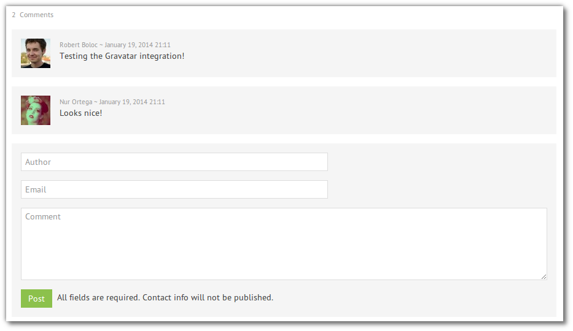

[](https://travis-ci.org/robertboloc/RbComment)

Zend Framework 2 module for drop-in self-hosted comments.

#### Installation

1. Add the module key to your `composer.json` file
```json
    {
        "require": {
            "robertboloc/rbcomment": "dev-master"
        }
    }
```

2. Run `composer update`

3. Import the schema from `data/schema.sql` into your database.

4. Add the new module to your application's modules list in `config/application.config.php`
```php
    'modules' => array(
        'Application',
        'RbComment',
    ),
```

***

#### Usage

In your views use the `rbComment` helper to display the count, the list and a form for adding new comments. Invoke it
where you want your comments box to appear. Simple isn't it? This helper can be used in any view.

```php
<?php echo $this->rbComment($theme) ?>
```
The `$theme` parameter is used to specify the theme of the comments box (if none is specified `default` is used).

Currently, the module is designed to allow only one comment box per page, as it uses
the page uri to identify a thread.

***

#### Themes

The module comes with 2 themes for now. To implement new ones create a new partial using
as base the existing ones.

Use your new theme calling `$this->rbComment('yourpartial')`

The current themes (and possible values of the `$theme` parameter if not using a custom partial) are :

##### default
Basic theme with no external dependencies. Contains the minimum styling to make it look decent.

##### uikit
This theme requires the [UIkit](http://www.getuikit.com/) CSS framework. If you use it in your project this theme
will make your comments box look awesome.

***

#### Configuration
The default configuration of the module can be found in the file `config/module.config.php`.
To override the defaults, add your values under the `rb_comment` key in the `config/autoload/local.php` file
of your application, using the same structure as in the defaults.

Currently the configurable parameters are:

##### default_visibility
This parameter controls the visibility of the newly published comments. If set to 1 all new published comments will be
visible. If 0 they will not be shown. This is useful for moderation.

##### strings
This array contains the translations for the strings used in the comments box. To change or translate to another language
override these values with your own.

##### email
This array contains email notifications parameters
```php
'email' => array(
    /**
     * Send email notifications.
     */
    'notify' => false,
    /**
     * Email addresses where to send the notification.
     */
    'to' => array(),
    /**
     * From header. Usually something like noreply@myserver.com
     */
    'from' => '',
    /**
     * Subject of the notification email.
     */
    'subject' => 'New Comment',
    /**
     * Text of the comment link.
     */
    'context_link_text' => 'See this comment in context',
),
```
For sending the emails the module uses a service factory called `RbComment\Mailer`. As a default it configures a sendmail transport. This should be changed in production and customized to your needs (probably with smtp). To do this rewrite the service factory in your `config/autoload/global.php` file.
```php
'service_manager' => array(
    'factories' => array(
        /**
         * Placeholder transport config. Do not use this in production.
         * Replace with smtp.
         */
        'RbComment\Mailer' => function () {
            return new Zend\Mail\Transport\Sendmail();
        },
    ),
),
```
***
#### Preview


***
#### Notes
If you are using the BjyAuthorize module (or any other route restricting module)
make sure the route `rbcomment` is publicly accessible.